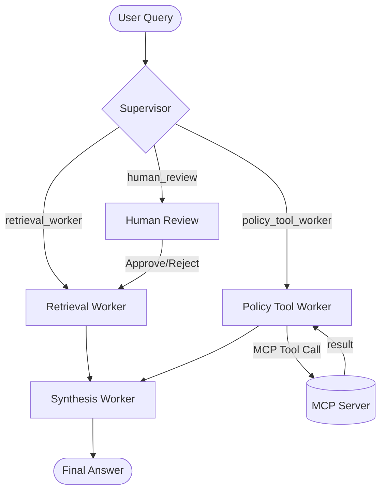

# System Architecture — Lab Day 09

**Nhóm:** C401-C3 
**Ngày:** 2026-04-14  
**Version:** 1.0

---

## 1. Tổng quan kiến trúc

**Pattern đã chọn:** Supervisor-Worker  
**Lý do chọn pattern này (thay vì single agent):** Hệ thống cần xử lý nhiều loại yêu cầu khác nhau (tra cứu tài liệu, phân tích chính sách phức tạp, tra cứu ticket qua API). Việc tách nhỏ thành các worker giúp (1) Tối ưu prompt cho từng nhiệm vụ, (2) Dễ dàng mở rộng tính năng qua MCP mà không làm loãng context của supervisor, và (3) Có khả năng can thiệp của con người (HITL) cho các trường hợp rủi ro cao.

---

## 2. Sơ đồ Pipeline

**Sơ đồ thực tế của nhóm:**

---

## 3. Vai trò từng thành phần

### Supervisor (`graph.py`)

| Thuộc tính | Mô tả |
|-----------|-------|
| **Nhiệm vụ** | Phân loại yêu cầu người dùng và điều phối tới worker phù hợp. |
| **Input** | Câu hỏi của người dùng (task). |
| **Output** | supervisor_route, route_reason, risk_high, needs_tool. |
| **Routing logic** | Kết hợp Keyword matching và LLM classification. |
| **HITL condition** | Khi phát hiện risk_high=True (mã lỗi lạ hoặc yêu cầu admin). |

### Retrieval Worker (`workers/retrieval.py`)

| Thuộc tính | Mô tả |
|-----------|-------|
| **Nhiệm vụ** | Thực hiện tìm kiếm semantic trên ChromaDB để lấy evidence. |
| **Embedding model** | `text-embedding-3-small` (1536 dims). |
| **Top-k** | 3-5 chunks. |
| **Stateless?** | Yes. |

### Policy Tool Worker (`workers/policy_tool.py`)

| Thuộc tính | Mô tả |
|-----------|-------|
| **Nhiệm vụ** | Xử lý các yêu cầu liên quan đến chính sách và gọi các MCP tools. |
| **MCP tools gọi** | `search_kb`, `get_ticket_info`, `check_access_permission`, `create_ticket`. |
| **Exception cases xử lý** | Flash Sale, digital products, probation period, Level 3 access. |

### Synthesis Worker (`workers/synthesis.py`)

| Thuộc tính | Mô tả |
|-----------|-------|
| **LLM model** | `gpt-4o-mini` |
| **Temperature** | 0.1 |
| **Grounding strategy** | CHỈ dùng context cung cấp, trích dẫn [tên_file] |
| **Abstain condition** | Khi confidence < 0.3 hoặc không có evidence. |

### MCP Server (`mcp_server.py`)

| Tool | Input | Output |
|------|-------|--------|
| search_kb | query, top_k | chunks, sources |
| get_ticket_info | ticket_id | ticket details |
| check_access_permission | access_level, requester_role | can_grant, approvers |
| create_ticket | priority, title, description | ticket_id, status |

---

## 4. Shared State Schema

| Field | Type | Mô tả | Ai đọc/ghi |
|-------|------|-------|-----------|
| task | str | Câu hỏi đầu vào | supervisor đọc |
| supervisor_route | str | Worker được chọn | supervisor ghi |
| route_reason | str | Lý do route | supervisor ghi |
| retrieved_chunks | list | Evidence từ retrieval | retrieval ghi, synthesis đọc |
| policy_result | dict | Kết quả kiểm tra policy | policy_tool ghi, synthesis đọc |
| mcp_tools_used | list | Tool calls đã thực hiện | policy_tool ghi |
| final_answer | str | Câu trả lời cuối | synthesis ghi |
| confidence | float | Mức tin cậy | synthesis ghi |
| hitl_triggered | bool | Trạng thái kích hoạt HITL | supervisor ghi |

---

## 5. Lý do chọn Supervisor-Worker so với Single Agent (Day 08)

| Tiêu chí | Single Agent (Day 08) | Supervisor-Worker (Day 09) |
|----------|----------------------|--------------------------|
| Debug khi sai | Khó — không rõ lỗi ở đâu | Dễ hơn — test từng worker độc lập |
| Thêm capability mới | Phải sửa toàn prompt | Thêm worker/MCP tool riêng |
| Routing visibility | Không có | Có route_reason trong trace |
| Latency | Thấp (1 LLM call) | Cao (nhiều LLM/Tool calls) |

**Nhóm điền thêm quan sát từ thực tế lab:**
Hệ thống Multi-agent vượt trội ở các câu hỏi "ngầm" — ví dụ khi hỏi về hoàn tiền, Supervisor tự hiểu cần gọi `policy_tool_worker` để check các case ngoại lệ thay vì chỉ search keyword thô.

---

## 6. Giới hạn và điểm cần cải tiến

1. **Độ trễ (Latency)**: Các câu hỏi qua nhiều bước có thể mất >10s.
2. **Chi phí (Cost)**: Tốn token cho nhiều bước trung gian.
3. **Cải tiến**: Tích hợp thêm OCR cho tài liệu scan.
