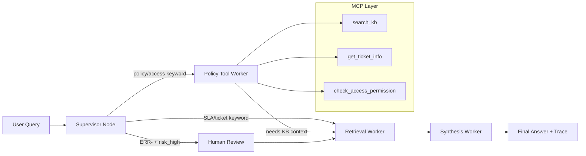

# 📋 KẾ HOẠCH CÁ NHÂN — MINH (Trace & Docs Owner)
> **Lab Day 09 — Multi-Agent Orchestration**  
> **Vai trò:** Trace & Docs Owner → Sprint 4 Lead  
> **Nhánh làm việc:** `feature/trace-docs`

---

## 🎯 Bức tranh toàn cảnh của Minh

Minh chịu trách nhiệm chính cho **Sprint 4**: chạy eval pipeline, phân tích trace, và hoàn thiện toàn bộ tài liệu. Đây là sprint **quan trọng nhất cho điểm số** — 30 điểm grading questions + 10 điểm docs.

**Files chính:**
- `eval_trace.py` — Chạy pipeline, phân tích trace (chủ yếu đã implement sẵn)
- `docs/system_architecture.md` — Mô tả kiến trúc + Mermaid diagram
- `docs/routing_decisions.md` — 3 routing decisions từ trace thực
- `docs/single_vs_multi_comparison.md` — So sánh Day08 vs Day09 với số liệu
- `reports/group_report.md` — Báo cáo nhóm

**Điểm nhóm phụ thuộc vào Minh:**  
- Group Documentation: 10 điểm  
- Grading run log đúng format: ảnh hưởng 30 điểm

---

## 📌 SETUP NHÁNH

```bash
cd "d:\gitHub\AI_20k\Day 8-9-10\Lecture-Day-08-09-10\day09"

# Lấy nhánh từ remote
git fetch origin
git checkout feature/trace-docs
# Hoặc tự tạo:
git checkout -b feature/trace-docs
```

> ⚠️ **Dependency:** Sprint 4 cần Sprint 1+2+3 xong. Minh bắt đầu sau khi Trung merge Sprint 2 vào main và `python graph.py` chạy được.

---

## 🔥 SPRINT 4 — Minh làm gì cụ thể?

### Bước M4.1 — Verify `eval_trace.py` chạy được

File `eval_trace.py` đã implement sẵn. Bước đầu là chạy thử:

```bash
python eval_trace.py
```

Nếu có lỗi (thường gặp):
- `ModuleNotFoundError`: kiểm tra import path
- `FileNotFoundError`: tạo thư mục còn thiếu:
  ```bash
  mkdir -p artifacts/traces
  ```
- Graph chưa ready: confirm với Trung

Khi chạy thành công, output sẽ gồm 15 trace files trong `artifacts/traces/`.

### Bước M4.2 — Phân tích trace và lấy số liệu thực

```bash
python eval_trace.py --analyze
```

Ghi lại kết quả thực tế (sẽ dùng cho docs):
```
📊 Trace Analysis:
  total_traces: 15
  routing_distribution:
    retrieval_worker: X/15 (XX%)
    policy_tool_worker: Y/15 (YY%)
    human_review: Z/15 (ZZ%)
  avg_confidence: 0.XX
  avg_latency_ms: XXXX
  mcp_usage_rate: X/15 (XX%)
  top_sources: [...]
```

```bash
python eval_trace.py --compare
# Output: artifacts/eval_report.json
```

### Bước M4.3 — Điền `docs/system_architecture.md`

Đọc file template hiện có, điền vào (không viết từ đầu):

**Nội dung cần có (4 điểm):**
1. Mô tả rõ vai trò từng worker *(2 điểm)*  
2. Sơ đồ Mermaid pipeline *(1 điểm)*  
3. Lý do chọn supervisor-worker thay vì single agent *(1 điểm)*

**Mermaid diagram mẫu:**
```markdown

```

### Bước M4.4 — Điền `docs/routing_decisions.md`

Lấy **ít nhất 3 routing decisions thực** từ trace files trong `artifacts/traces/`:

```bash
# Đọc trace file và lấy routing info
python -c "
import json, os
traces_dir = 'artifacts/traces'
for f in os.listdir(traces_dir)[:5]:
    with open(os.path.join(traces_dir, f)) as fp:
        t = json.load(fp)
    print(f'Task: {t[\"task\"][:60]}')
    print(f'Route: {t[\"supervisor_route\"]}')
    print(f'Reason: {t[\"route_reason\"]}')
    print(f'Workers: {t[\"workers_called\"]}')
    print(f'MCP: {t[\"mcp_tools_used\"]}')
    print()
"
```

Template cho mỗi quyết định routing:
```markdown
### Decision 2: Flash Sale Refund Query
- **Task:** "Khách hàng Flash Sale yêu cầu hoàn tiền vì sản phẩm lỗi — được không?"
- **Worker được chọn:** `policy_tool_worker`
- **Route reason:** "policy/access keyword detected: ['flash sale', 'hoàn tiền']"
- **Workers called:** ['policy_tool_worker', 'retrieval_worker', 'synthesis_worker']
- **MCP tools used:** ['search_kb']
- **Kết quả:** policy_applies=False, flash_sale_exception detected, confidence=0.72
```

### Bước M4.5 — Điền `docs/single_vs_multi_comparison.md`

Lấy số liệu từ `artifacts/eval_report.json`, điền vào template:

**Metrics so sánh bắt buộc (ít nhất 2):**

| Metric | Day 08 Single Agent | Day 09 Multi-Agent |
|--------|--------------------|--------------------|
| Avg Latency | ~XXXms | ~XXXms |
| Avg Confidence | 0.XX | 0.XX |
| Debuggability | Không trace được từng bước | route_reason + worker_io_logs |
| Abstain Rate | Không có abstain | X/15 câu abstain khi thiếu evidence |
| Multi-hop Accuracy | Không phân biệt nguồn | Cross-doc retrieval từ 2 sources |

> ⚠️ **Quan trọng:** Phải có **số liệu thực** từ trace. Không dùng số giả định.  
> Day 08 baseline: tham khảo `lab_day8/day8_baseline.txt`

### Bước M4.6 — Chạy Grading (SAU 17:00 — ưu tiên cao nhất)

```bash
# Sau 17:00, khi grading_questions.json được public:
python eval_trace.py --grading

# Verify output:
cat artifacts/grading_run.jsonl | python -c "
import json, sys
for line in sys.stdin:
    r = json.loads(line)
    print(f\"[{r['id']}] route={r['supervisor_route']}, conf={r['confidence']:.2f}: {r['question'][:50]}\")
"
```

Verify tất cả 10 câu có đủ fields bắt buộc:
- `id`, `question`, `answer`, `sources`, `supervisor_route`, `route_reason`
- `workers_called`, `mcp_tools_used`, `confidence`, `hitl_triggered`, `timestamp`

---

## 📦 COMMIT FLOW CỦA MINH

### Commit 1 — Sau khi eval_trace.py chạy được:
```bash
git add eval_trace.py artifacts/
git commit -m "feat(trace): run 15 test questions, analyze traces

- eval_trace.py: runs end-to-end without crash (15/15 succeeded)
- artifacts/traces/: 15 trace JSON files saved
- Trace metrics:
  * routing: retrieval X%, policy_tool Y%, human_review Z%
  * avg_confidence: 0.XX
  * avg_latency: XXXms
  * mcp_usage: X/15 queries
  * top sources: sla_p1_2026.txt (X), policy_refund_v4.txt (Y)
- eval_report.json: comparison Day08 vs Day09 saved

Refs: Sprint 4 - Trace & Docs Owner"
git push origin feature/trace-docs
```

### Commit 2 — Sau khi docs hoàn thiện:
```bash
git add docs/
git commit -m "docs: complete system_architecture, routing_decisions, single_vs_multi

- system_architecture.md: 
  * Mermaid flowchart: supervisor → conditional edge → workers → synthesis
  * MCP layer sub-graph (search_kb, get_ticket_info, check_access)
  * Supervisor-worker vs single-agent tradeoffs
- routing_decisions.md: 3 real routing decisions from trace:
  * Decision 1: SLA P1 → retrieval_worker (SLA keyword)
  * Decision 2: Flash Sale → policy_tool_worker (flash sale keyword)
  * Decision 3: Level 3 emergency → policy_tool_worker + MCP call
- single_vs_multi_comparison.md:
  * Latency: Day08 XXXms vs Day09 XXXms
  * Confidence: 0.XX vs 0.XX
  * Debuggability: trace + route_reason vs black box
  * Abstain: X/15 correct abstain on unknown queries

Refs: Sprint 4 - Trace & Docs Owner"
git push origin feature/trace-docs
```

### Commit 3 — Grading run (trước 18:00, QUAN TRỌNG NHẤT):
```bash
git add artifacts/grading_run.jsonl
git commit -m "grading: run grading_questions.json - X/10 queries completed

- artifacts/grading_run.jsonl: 10 grading queries
- All records have required fields: id, question, answer, sources, supervisor_route, 
  route_reason, workers_called, mcp_tools_used, confidence, hitl_triggered, timestamp
- gq07 (abstain): correctly abstain - no financial penalty info in docs
- gq09 (multi-hop): both SLA escalation + Level 2 access procedure retrieved
- route_reason: non-empty for all 10 queries
- timestamp: [TIME]

⚠️ COMMITTED BEFORE 18:00 DEADLINE

Refs: Sprint 4 - Trace & Docs Owner"
git push origin feature/trace-docs
```

### Commit 4 — Group report (sau 18:00 — được phép):
```bash
git add reports/group_report.md
git commit -m "docs: group report complete

- Group: Trung (Tech Lead), Nghia (Supervisor), Dat (Worker), Vinh (MCP), Minh (Trace)
- Sprint achievements documented with actual metrics
- Architecture decision: LangGraph StateGraph with keyword-based routing
- MCP: FastMCP server (bonus implementation)
- Grading results: submitted before 18:00

Refs: Sprint 4 - Trace & Docs Owner"
git push origin feature/trace-docs
```

---

## ⚠️ GQ07 — Câu abstain (10 điểm, không được hallucinate)

Câu gq07 hỏi về "mức phạt tài chính vi phạm SLA P1" — **không có trong tài liệu**.

Pipeline phải trả lời: **"Không có thông tin trong tài liệu nội bộ về mức phạt tài chính."**

Nếu grading run trả lời sai gq07, Minh cần báo Trung để kiểm tra `synthesis.py` có enforce không hallucinate không.

---

## 📝 BÁO CÁO CÁ NHÂN — Gợi ý nội dung

File: `reports/individual/Minh.md`

**Phần bạn phụ trách:** `eval_trace.py`, 3 doc templates, `reports/group_report.md`  
**1 quyết định kỹ thuật:** Tại sao chọn lấy 3 routing decisions từ trace thực (không giả định) để điền docs? (credibility, trace = ground truth cho đánh giá, evidence từ routing_decisions.md)  
**1 lỗi đã sửa:** Lỗi `eval_trace.py` khi trace field `mcp_tools_used` là list of dict thay vì list of string (extraction `t.get("tool")` vs `t`); hoặc lỗi JSONL format  
**Tự đánh giá:** Trace & Docs Owner là người ảnh hưởng lớn nhất đến điểm số, đặc biệt grading đúng deadline  
**Nếu có 2h thêm:** Thêm automated accuracy evaluation so sánh answer với expected_answer trong test_questions.json, evidence từ eval_report.json
